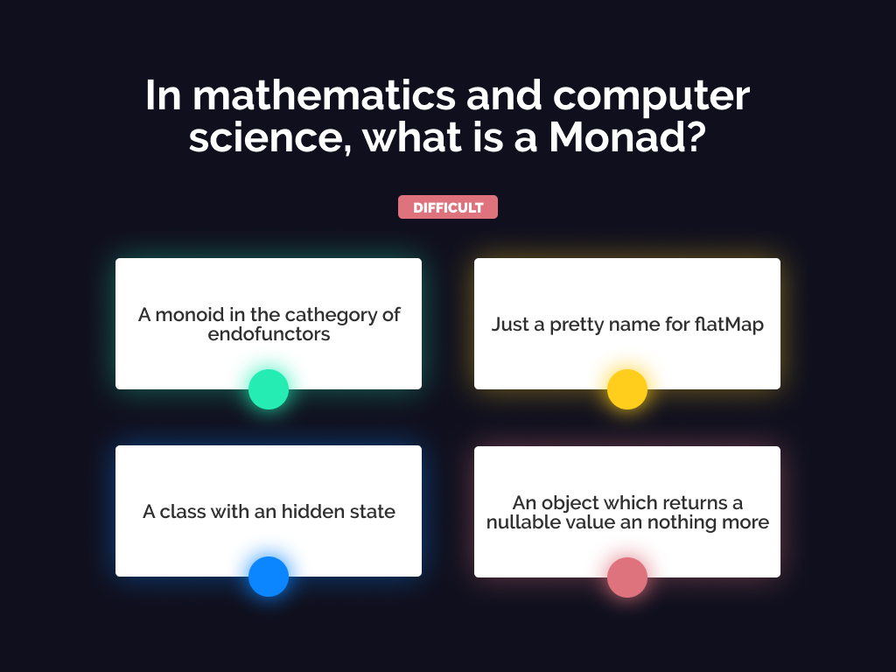

[](https://app.netlify.com/sites/openmind-codemotion-game/deploys)


<br />

The source code of the Codemotion stand quiz by openmind. <br />
Built in **ReasomML**, **Reason-React** and **Stylus**.

# Getting started

Just clone this repository

```sh
git clone git@github.com:openmindlab/codemotion-game.git
```

install dependencies

```sh
npm i
```

run the BuckleScript compiler

```sh
npm run start
```

now in another tab, run the webpack compilation

```sh
npm run webpack
```

now you can open the development HTML page:

```sh
open ./build/index.html
```

happy coding!


# License
[Apache 2.0](/LICENSE.md)